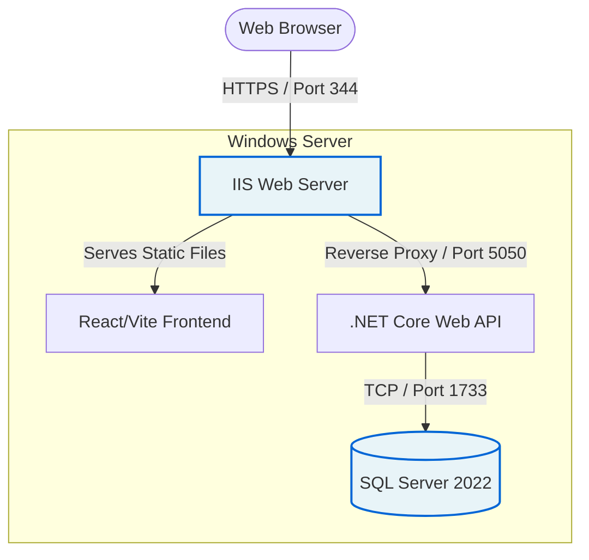

#  Full-Stack Deployment & Infrastructure Playbook

## Overview
This repository serves as my personal knowledge base and professional runbook for deploying full-stack enterprise applications to raw Windows Server environments. 

Rather than storing proprietary application code, this playbook documents the operational architecture, infrastructure provisioning, and troubleshooting methodologies required to take an application from a local development environment to a live, secure production server.

## Tech Stack & Environment
* **OS:** Windows Server
* **Web Server:** IIS (Internet Information Services)
* **Database:** SQL Server 2022 Express
* **Backend:** .NET Core Web API
* **Frontend:** React / Vite (Single Page Application)

## System Architecture
This diagram illustrates the traffic flow and port configuration of the deployed environment.

## Core Competencies Documented
* **Infrastructure Provisioning:** Configuring Windows Server, IIS, and SQL Server from scratch.
* **Database Security:** Managing Mixed Mode Authentication and configuring TCP/IP firewalls.
* **Web Server Management:** Handling SPA routing conflicts using IIS URL Rewrite.
* **Network Security:** Managing CORS policies and Windows Firewall Inbound/Outbound rules.

## Document Index
1. [Windows Server & IIS Build Pipeline](01-windows-server-setup.md)
2. [SQL Server Security & Provisioning](02-sql-server-provisioning.md)
3. [Resolving SPA Refresh Errors in IIS](03-iis-spa-routing.md)
4. [Network Debugging & CORS Troubleshooting](04-troubleshooting-cors.md)

## Future Enhancements (Roadmap)
While this current architecture is stable and secure for a standalone Windows Server environment, future iterations of this deployment pipeline will focus on automation and observability:
* **CI/CD Automation:** Implement GitHub Actions to automatically compile the `.NET` backend and bundle the `React` frontend upon merging to the main branch.
* **Centralized Logging:** Integrate Serilog into the backend to write rolling log files directly to the server, eliminating the need to manually execute the binary for debugging.
* **Secret Management:** Migrate the hardcoded SQL `sa` credentials out of `appsettings.json` and into Windows Environment Variables to prevent accidental credential leakage.
